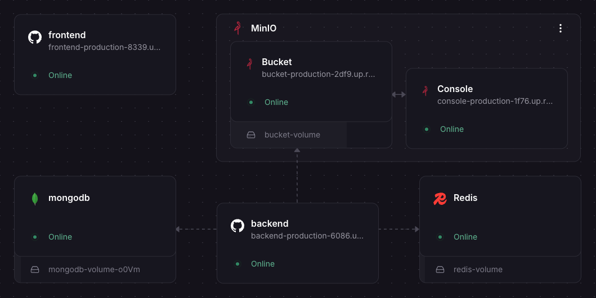
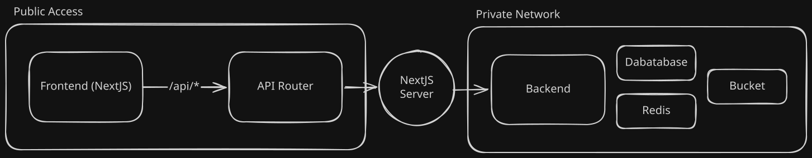

# Fireflies Clone

This is the parent repository. Backend and frontend live in their own Git repos and are pulled in as [Git submodules](https://docs.github.com/en/repositories/working-with-files/using-files/working-with-submodules). This repo only pins the SHAs for [backend](https://github.com/d4vz/fireflies-tech-challenge-backend) and [frontend](https://github.com/d4vz/fireflies-tech-challenge-frontend).

**Why Git Modules?** I split the apps into two repositories instead of a monorepo. Separate repos are easier to work with, and they map better to Railway, where I deployed each app as its own service.

## Overview



The frontend is [Next.js](https://nextjs.org), with [TanStack Query](https://tanstack.com/query/latest) for server state and [shadcn/ui](https://ui.shadcn.com) for the UI. The browser never talks to the backend. It hits Next.js API routes, and those routes call the private network. That is how the Hono server and the MinIO bucket stay off the public internet. Only the Next.js server can reach them.



The backend is one Bun process running [Hono](https://hono.dev). MongoDB is the primary database. Meetings can arrive from different sources and the shape is not fixed, so a document store fits, and [MongoDB Vector Search](https://www.mongodb.com/docs/atlas/atlas-vector-search/vector-search-overview/) lets us search across embeddings. Blobs go to [MinIO](https://min.io), an S3-compatible store we run ourselves. Redis backs [BullMQ.](https://docs.bullmq.io) This README is the parent overview. More documentation will live in each child repo:

## Clone

```
git clone --recurse-submodules https://github.com/d4vz/fireflies-tech-challenge.git
```
